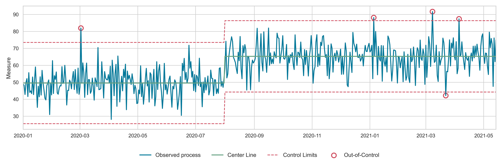

<p align="left">
  
</p>

# SPyC

SPyC is a Python library for Statistical Process Control (SPC), developed to support analytics at Somerset Foundation Trust. It provides a centralised and flexible framework for monitoring healthcare time series data.

The package supports a range of SPC chart types (including X, moving range, and p-charts) and can be extended further with custom functions. It supports multiple changepoints, allowing control line re-calculation following system changes (e.g., ward reconfigurations). SPyC can also account for seasonal variation by calculating separate control limits for each seasonal period, negating the need to separate data into multiple charts.

## Installation

To install spyc using pip:

```bash
python -m pip install spyc
```

## Simple Usage

```python
from spyc import SPC, spc_functions, spc_plots

# Instantiate SPC object
spc_example = SPC(data_in=df, # df is a Pandas.DataFrame (with DateTimeIndex)
                  target_col="value") # column name in data_in

# Process changepoint
spc_example.add_process_change_date(
    change_date="2020-08-01"
)

# Calculating control lines and storing results in a Pandas DataFrame
example_data = spc_example.calculate_spc(
    spc_calc_func=spc_functions.x_chart,  # importing X-chart
    rule_1=True) # SPC rules bool

# Pass in dataframe to create SPC chart
fig, ax = spc_plots.seaborn_chart(example_data)
```



_For more examples, refer to the [Example Notebook](example_notebook.ipynb)_

## Contributing

Pull requests are welcome. Otherwise, feel free to open an issue to discuss changes you would like to make.